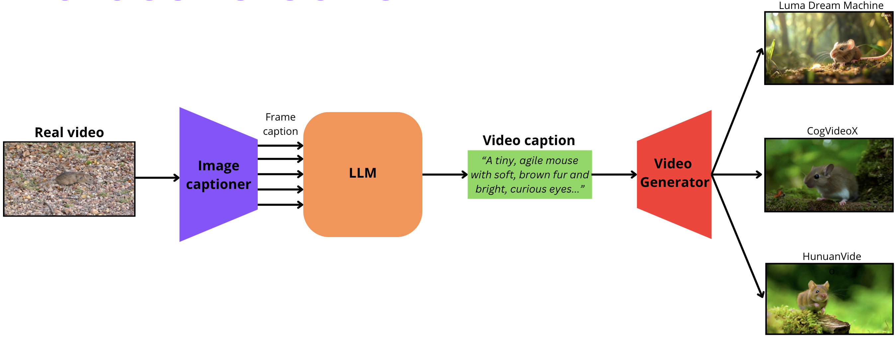

# Video Captioning

This repository contains a Python script designed to generate textual captions for videos using an AI model.

I used it to generate captions starting from real videos to generate corrispondent synthetic videos:

  

## How It Works

The `captioning.py` script processes videos located in the `real_videos` folder and generates a textual description (caption) for each video.  
The generated captions are saved in a CSV file named `video_captions.csv`.

## Instructions

1. **Install Dependencies**:  
   Ensure you have Python installed on your system. Install the required libraries by running:

   ```bash
   pip install -r requirements.txt
   ```
   
2. **Add Videos**:
  Place the videos you want to process in the `real_videos` folder.

3. **Run the Script**:
  Execute the script by running:

  ```bash
  python captioning.py
  ```

4. **View Results**:
  The generated captions will be saved in the video_captions.csv file. You can open this file with any text editor or spreadsheet software.

---

a. **Model Used**:
The script uses BLIP2 pre-trained model to generate captions for single frames and then pass it to llama3.2 to compose the description for the video. 
The `model_query.py` file contains the functions required to interact with the model.

b. z**Custom Prompt**:
The `prompt.txt` file contains the textual prompt used to guide the caption generation. You can modify this file to customize the captions generated.

c. **Video Format**:
Ensure that all videos in the `real_videos` folder are in a format supported by your Python environment.

d. **Support**
For additional help or information, consult the documentation within the repository or contact the repository's maintainer.
Let me know if you need further modifications!
